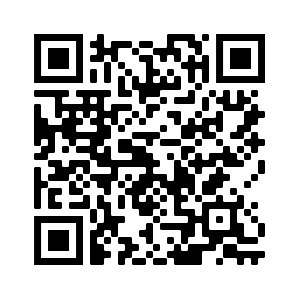

# Lecture: Radio Interferometry
* Time: (2022O October 05 - November 30) 2:20-5:20 pm, Wednesday
* Lecturer: [Hauyu Baobab Liu](https://baobabyoo.github.io/) (呂浩宇)
* Location: NTNU, College of Science, Building B413 (理學院B413)
* Language: English
* Off-class communication interface: this github page

### SMA Project Group
- **Star-formation** H.-T. Lee, N.-J. Lin, T.-S. Chen, X.-R. Tsai
- **AGN** P.-C. Hsu, C.-F. Chen, J.-Y. Gu
- **High-z and starburst** C.-L. Liao, M.-N. Chen, T.-H. Kuo

## Syllabus:
1. (October 05) Principle of radiation; basic observational parameters; how to check [ALMA data archive](https://almascience.nao.ac.jp/aq/) and produce publication-level figures.
2. (October 12) Single-dish telescope (1.5 hr); SMA proposal preparation (1.5 hr)
3. (October 19) Interferometer (2 hr); SMA proposal discussion (1 hr)
4. (October 26) mid-term exam
5. (November 02) Principle of data calibration; SMA observing script preparation
6. (November 09) Participate observations as a post mid-term party (**Nov. 09, priming starts as early as Taipei time 10 am and finish at 11:45 am. Tentative plan: observing passband and flux calibrators until 7 pm HST, then observe AGN-group for 2 hrs -> Starburst-group for 1 hr -> demo-group for 1.5 hrs -> SF-group for 0.5 hr**)
7. (November 16) Error recognition; Hands-on data calibration
8. (November 23) Principle of imaging; Hands-on data calibration, imaging
9. (November 30) Noise; Final (group) presentation

## Goal:
1. Being able to download archival ALMA data, examine images, and produce figures.
  * Installing [CASA software package](https://casa.nrao.edu/)
  * Trying [ALMA data archive](https://almascience.nao.ac.jp/aq/)
  * Using the [APLpy python package](https://aplpy.github.io/) to create PDF figures.
2. Knowing the principles of radio interferometry.
3. Knowing how to use the [Submillimeter Array](http://sma1.sma.hawaii.edu/)
  * Proposing (for some instruction see [my webpage](https://baobabyoo.github.io/pages/students_topics/UsingTelescope_SMA.html))
  * Calibrating data using either the [CASA software package](https://casa.nrao.edu/) or [MIR IDL software package](https://lweb.cfa.harvard.edu/~cqi/mircook.html) (requiring an access to [IDL](https://www.l3harrisgeospatial.com/docs/idl_programming.html))

## Expectation:
1. This is a 3-credits' course. The expected weekly workload for you is 2 hours on average if you have no experience and knowledge in this area.
2. There is no final exams. The workload for you to produce your final report may be 10~15 hours if you have no experience and knowledge in this area.

## Assessment (please ignore this part):
Students will be divided in to groups (3 groups in total, ~3 members in each group).
1. **(30 points)** Each group is expected to hand in an SMA proposal (Abstract, 1 page text for technical setup, and 1 page figure) **for the observations that can be carried out at night time in late October or early November** before October 26. If there is no error then everybody in the group will get 30 points. In case of small errors (e.g., over optimistic or pessimistic sensitivity estimates or no sensitivity estimate at all) you may get 15~30 points. You may get **0 point** in case of inattentive errors (e.g., your proposed observations can only be carried out during daytime, the proposed observing frequency is not supported by the SMA, requiring infeasibly fine angular resolution or unreasonably large mosaic field of view, etc). **You can bring up your proposal for a discussion in the lecture on October 19 during when we can screen most of the inattentive errors.**
2. **(70 points)** Demo your data reduction in the final presentation (1 hr for each group). The presentation will be led by only 1 person I randomly select. You get **55~70 points** if you can obtain an image and if the signal-to-noise is within 50% of my calibration (the exact grade depends on how well the presenter explain the data calibration); you get **40~55 pointgs** if you obtain an image but the signal-to-noise or absolute flux is way off; you get **0 points** in case of not being able to obtain an image. *We will calibrate your data during the hands-on sessions on November 09 and 23. We may track down your problem in the data reduction unless you are really unprepared. But if one of the member in a group stays inattentive and he happens to be selected as the one who is going to lead the final presentation, then, that is the bitter part of the life...*

There is no roll call. If you are confident that you can prepare and submit a proper proposal and you can reduce SMA data and yield an image, you do not have to show up. On the other hand, if your group member(s) need your help, you can help them, and you don't, then there is 1/3~2/3 chance that you will experience some bitter. This is how actual scientific collaboration feels like. So I would encourage to be inclusive, collaborative, and reachable.

## Software:
1. [MIR IDL](https://lweb.cfa.harvard.edu/~cqi/mircook.html) (recommended but not required)
2. [Miriad](https://lweb.cfa.harvard.edu/sma/miriad/) (recommended but not required)
3. [CASA](https://casa.nrao.edu/) It is highly recommended to install it.
4. If you need a workstation to host the archival ALMA data or to calibrate your SMA observations to be taken, please reply to [Issue 1](https://github.com/baobabyoo/Lecture_RadioInterferometry_2022Oct/issues/1). We will create a tentative account for you to login to the powerful workstations at [ASIAA](http://www.asiaa.sinica.edu.tw/). I will let you know how to use VPN to connect to our internal network. If your OS is Microsoft Windows, you may ssh to a Linux workstation using the [PuTTY](https://www.putty.org/) interface (I used to use this one although that was 2 decades ago... there may be newer ones).
5. If you do not know how to use Linux and if you read Chinese, this webpage  [鳥站](https://linux.vbird.org/linux_basic/redhat6.1/linux_06command.php) may help.

## Suggested Textbooks:
1. [Synthesis Imaging in Radio Astronomy II](https://www.aspbooks.org/a/volumes/table_of_contents/?book_id=292) (primary; free to download)
2. [Interferometry and Synthesis in Radio Astronomy](https://link.springer.com/book/10.1007/978-3-319-44431-4) (advanced reference)
3. [Tools of Radio Astronomy](https://link.springer.com/book/10.1007/978-3-540-85122-6) (handy but buggy)
4. All qualitative introduction is given in [my webpage](https://baobabyoo.github.io/pages/students_topics/AstroBasic_RadioInterferometer.html)
5. I heard that the [Radio Astronomy textbook writen by John Kraus](https://www.amazon.com/Radio-Astronomy-John-Daniel-Kraus-dp-1882484002/dp/1882484002/ref=mt_other?_encoding=UTF8&me=&qid=) is also good, although I have never seen it.

## Individual Lectures

#### Lecture 1 (2022 October 05)
[Lecture notes: Principle of radiation and basic observational parameters](https://github.com/baobabyoo/Lecture_RadioInterferometry_2022Oct/blob/main/lecture_notes/RadioAstronomy_2022Oct_lecture1_NTNU.pdf)

##### Checking ALMA data archive
1. Connect to the [ALMA data archive](https://almascience.nao.ac.jp/aq/).
2. Find the `search` box in the upper left. Move the mouse cursor there and then find the source name box. Enter `HL_Tau, 0.1` to search for any observations that is targeting on the direction that is within **0.1 arcminutes** from the protoplanetary disk HL Tau (see [this webpage](https://www.eso.org/public/images/eso1436a/)) for a high quality press release.
3. Check the return in the bottom. There should be 28 observations, which were carried out at various frequency bands. You can find the continuum sensitivity in terms of Jy/beam and angular resolution in unit of arcsecond (1 arcminute is 1/60 degree; 1 arcsecond is 1/60 arcminute).
4. Let's try to inspect one of them online. Scroll down to the observations for the project `2017.1.01178.S` that has release date on `2021-02-12`. What are the frequency ranges of this observations? What is the angular resolution?
5. Check the box on the left of this item, and then click the green `Explore and Download` button. Many things will pop up. Scroll down to find the FITS file of the continuum image `member.uid___A001_X1284_X1742.HL_Tau_sci.spw25_27_29_31.cont.I.manual.pbcor.fits` and click on it to download. Inspect this FITS image using either **ds9** or **CASA viewer** (for an introduction about FITS image and these softwares, see [this page](https://baobabyoo.github.io/pages/students_topics/software_tips_FITS.html)).
6. Try to prepare a publication-level figure using the Python package APLpy (an example is provided [here](https://baobabyoo.github.io/pages/students_topics/software_tips_FITS.html#4-working-with-fits-using-software-languages)). If you are not yet familiar with Python, see an introduction [here](https://baobabyoo.github.io/pages/students_topics/software_tips_python.html). You can also google it.
7. We are going to observe with the SMA in 1 month. You can check the figures and tables in the following papers [Long et al. (2018)](https://ui.adsabs.harvard.edu/abs/2018ApJ...869...17L/abstract), [Andrews et al. (2018)](https://ui.adsabs.harvard.edu/abs/2018ApJ...869L..41A/abstract), [Tobin et al. (2020)](https://ui.adsabs.harvard.edu/abs/2020ApJ...890..130T/abstract), and  [Yang et al. (2021)](https://ui.adsabs.harvard.edu/abs/2021ApJ...910...20Y/abstract) to find a few bright target sources in the Perseus, Taurus, and Orion molecular clouds which can be observed in nighttime in winter term. You can then try to download the images of your selected target source(s) and then check their angular size, spectral index, etc. If you are experienced with archival radio interferometric data already, you are also welcome to check other type of sources.

#### Lecture 2 (2022 October 12)
[Lecture notes: Understanding the response of single-dish telescopes, angular resolution](https://github.com/baobabyoo/Lecture_RadioInterferometry_2022Oct/blob/main/lecture_notes/RadioAstronomy_2022Oct_lecture2_NTNU.pdf)

##### SMA proposal preparation

1. A general comment about any proposal is given in [this webpage](https://baobabyoo.github.io/pages/students_topics/proposal.html).
2. A general guide for how to prepare an observational proposal can be found in [this webpage](https://baobabyoo.github.io/pages/students_topics/proposal_obs.html).
3. Information that is specific to the SMA can be found in [this webpage](https://baobabyoo.github.io/pages/students_topics/UsingTelescope_SMA.html).
4. A template of proposal can be found as an Overleaf project [here](https://www.overleaf.com/read/wndstmfyphpz). It is a part of a real SMA proposal of my student Greta Siu, with significant contribution from my former student Yuxin Lin.

#### Lecture 3 (2022 October 19)
[Lecture notes: Principle of radio interferometry](https://github.com/baobabyoo/Lecture_RadioInterferometry_2022Oct/blob/main/lecture_notes/RadioAstronomy_2022Oct_lecture3_NTNU.pdf)

Power ratio is often expressed in unit of [decibel (dB)](https://en.wikipedia.org/wiki/Decibel). Check the definition. It will appear in your mid-term exam.

#### Lecture 4 (2022 November 02)
[Lecture notes: Principle of data calibration](https://github.com/baobabyoo/Lecture_RadioInterferometry_2022Oct/blob/main/lecture_notes/RadioAstronomy_2022Oct_lecture4_NTNU.pdf)

The step-by-step guide for preparing observing script can be found [here](https://baobabyoo.github.io/pages/students_topics/UsingTelescope_SMA.html#2-organizing-observing-scripts).

#### Lecture 5 (2022 November 05)
Participating in SMA observations.
Our observing script is [here](https://github.com/baobabyoo/Lecture_RadioInterferometry_2022Oct/blob/main/Observing_script.txt).

#### Lecture 6 (2022 November 09)
(Instructed by Sheng-Feng Yen)

- Doppler track NGC7479
- Tuning:
    1. RxA: 230.538 GHz at USB, S2
    2. RxB: 230.538 GHz at LSB, s3
- Array configuration: Extended
- Weather constraint: less than 4 mm PWV
- Plan:
    1. After priming, observing passband and flux calibrators until 7 pm HST
    2. Observe AGN-group (NGC7479) for 2 hrs
    3. Observe Starburst-group (NGC253) for 1 hr
    4. Observe demo-group (J0412, ZZ Tau IRS) for 2.5 hrs
    5. Observe NGC2024-group (NGC2024 FIR5) for 0.5 hrs
- The summary of the SMA observations can be found [here](https://github.com/baobabyoo/Lecture_RadioInterferometry_2022Oct/blob/main/22B_A007_summary.png)
- The observing log can be found [here](https://github.com/baobabyoo/Lecture_RadioInterferometry_2022Oct/blob/main/22B_A007_log.png)

#### Lecture 6 (2022 November 16)

[Lecture notes: Error recognition](https://github.com/baobabyoo/Lecture_RadioInterferometry_2022Oct/blob/main/lecture_notes/RadioAstronomy_2022Oct_lecture5_NTNU.pdf)

- Launch the VPN client and `scp -Y` to one of the following workstations `almat5, almat6, almat7, almat8`
- The directory of demo science data can be copied from `/almalustre/home/hyliu/for_lecture/reduction/demo`
- The directory of the data of individual group can be found in `/almalustre/home/hyliu/for_lecture/raw`. Copy the data to your own working directory for further processing.
- The full MIR IDL procedure to calibrate the demo science data (ZZ Tau IRS) can be found [here](https://baobabyoo.github.io/pages/students_topics/UsingTelescope_SMA.html#433-full-procedure)
- To enable using the MIR IDL software package, type `source /asiaa/home/hyliu/software/MIR/sma-mir/setup.bsh` in the Linux command line.
- To launch IDL, type `IDL` in the Linux command line. Then we can enter the IDL commands in the IDL command-line.

#### Lecture 7 (2022 November 23)

[Lecture notes: Formation of image](https://github.com/baobabyoo/Lecture_RadioInterferometry_2022Oct/blob/main/lecture_notes/RadioAstronomy_2022Oct_lecture6_NTNU.pdf)

- To enable using the Miriad software package, type `source /asiaa/home/hyliu/software/Miriad/carma/miriad/miriad_start.sh` in the Linux command line.
- Follow the instruction in [Section 4.4.1 of my webpage](https://baobabyoo.github.io/pages/students_topics/UsingTelescope_SMA.html#441-flagging-edge-channels-and-continuum-subtraction) to perform edge-channel flagging and continuum baseline fitting/subtraction, using the Miriad software package (**Do try using the** `uvspec` **commands to inspect the spectral profiles if you have never done so**).
- Modify the script in [Section 4.4.2 of my webpage](https://baobabyoo.github.io/pages/students_topics/UsingTelescope_SMA.html#442-single-pointing-continuum-imaging) to image the continuum data (i.e., `*.ch0.miriad` files) and produce FITS images.
- If you science case include spectral line imaging, then follow the script in [Section 4.4.3 of my webpage](https://baobabyoo.github.io/pages/students_topics/UsingTelescope_SMA.html#443-single-pointing-spectral-lines-imaging) to extract a specific line and then try to image it (e.g., modify the imaging script from the previous, continuum imaging exercise).
- Follow the instruction [here](https://baobabyoo.github.io/pages/students_topics/software_tips_FITS.html#4-working-with-fits-using-software-languages) to generate at least a PDF figure of your continuum image. It is also encouraged to generated images (and/or spectra) for your spectral lines, e.g., you may try to summarize your spectral line observations in the ways that are similar to Figures 3, 4, 6, 7, 8, 13, and Table 1 of [this paper](https://ui.adsabs.harvard.edu/abs/2015ApJ...804...37L/abstract). Currently, one of the most sophisticated analysis of SMA observations of continuum and spectral line emission towards high-mass star-forming regions is [Lin et al. (2022)](https://ui.adsabs.harvard.edu/abs/2022A%26A...658A.128L/abstract). Reading this paper would give you some ideas about what physical parameters we can extract from these observational data, and how to do it.
- **Prepare an oral final report to be given on November 30. It can be either in Chinese or English. Each group has 15 minutes to introduce (1) how you selected your target sources and why, (2) problems in saw in the data calibration/imaging, and (3) your results. On November 30, I will give lecture for ~40 minutes, have a break of ~5 minutes, leave 90 minutes for you to discuss and modify your final presentation, and use the last 45 minutes for you to present your results. Each group will have only 1 representative to give the oral presentation. The representative will be randomly selected by me. **
- The purpose of conducting astronomical observations is writing paper. Find the template [here](https://www.overleaf.com/read/cwndkjfvfqgq) and learn to summarize what you did with a proper *Astrophysical Journal* format. **Hand in your final report before December 23 by E-mailing to me**.
